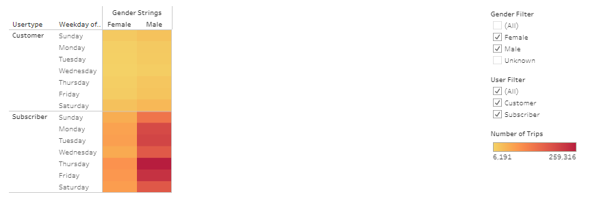

# Bikesharing: a presentation to open a bike sharing company in Des Moines

## Overview
Bike sharing is a profitable service in New York city and could potentially be successful in Des Moines. The Tableau images display information about bike usage in New York City. The images will be used to convince investors the bike business could be successful in Des Moines.

## Results

### Analysis
The data was downloaded from Citibke and used as is with two changes.  1) The tripduration column was provided as an integer. This was changed to a date using python. 2) The gender column originated as an integer, where 0 = unknown, 1 = male, and 2 = female.  This was updated to text using a calculated field in Tableau.

### Tableau Link
[Tableau Viz](https://public.tableau.com/app/profile/eric.anthony3731/viz/Module14ChallengeBikeShareViabilitybyEricAnthony/BikeShareViability)

### Figures

**Figure 1:** The number of trips taken at each hour during the day for the month of August. Note the peaks around 7AM and 5PM.

**Figure 2:** The length of time bikes were checked out. The usage is typically less than half an hour.

**Figure 3:** The length of time bikes were checked out by gender. More men used the bikes. When the time of use is compared between men and women the curves appear similar. 

**Figure 4:** Usage frequency by hour and day.  On the weekends, bikes are used evenly throughout daylight hours. On weekdays there are peaks around the morning and evening commutes. 

**Figure 5:** Bike usage by hour and day for each gender.  Males and females show similar patterns of use.

**Figure 6:** Bike usage for customers and subscribers depending on gender.  There seems to be little difference in the way bikes are used between genders and customers subscribers.  

**Figure 7:** Breakdown of users by gender.  There are more male users.

**Figure 8:**  Breakdown of users by user type and gender. There is a large percentage of customers with unknown gender complicating the analysis.

## Summary

### This Analysis

The majority of Citibike rides are taken by commuters. Any city where commuters live within biking distance from work could be viable. The majority of bike rides last less than 30 minutes giving us the range of typical biking distance. Of note is the gender disparity between males and females. Males were more likely to subscribe or checkout bikes without a subscription. With the information obtained through the analysis the business looks like it could be successful in Des Moines. 

### Additional Visualizations Needed

1)A visualization showing the most used start and stop stations between customers and subscribers.  The business is primarily supported by subscribers. Knowing where they go could allow service enhancements. 

2)The most frequently used start and end station stations versus time of day.  To ensure that there are enough bikes at the most popular start stations and enough space to accept bikes at the most used stop stations. 
